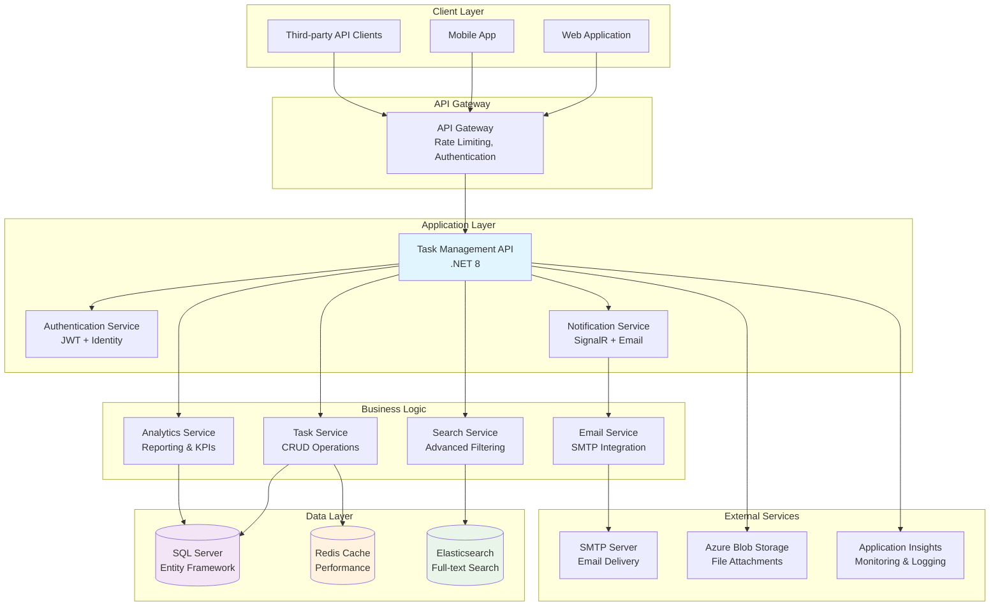
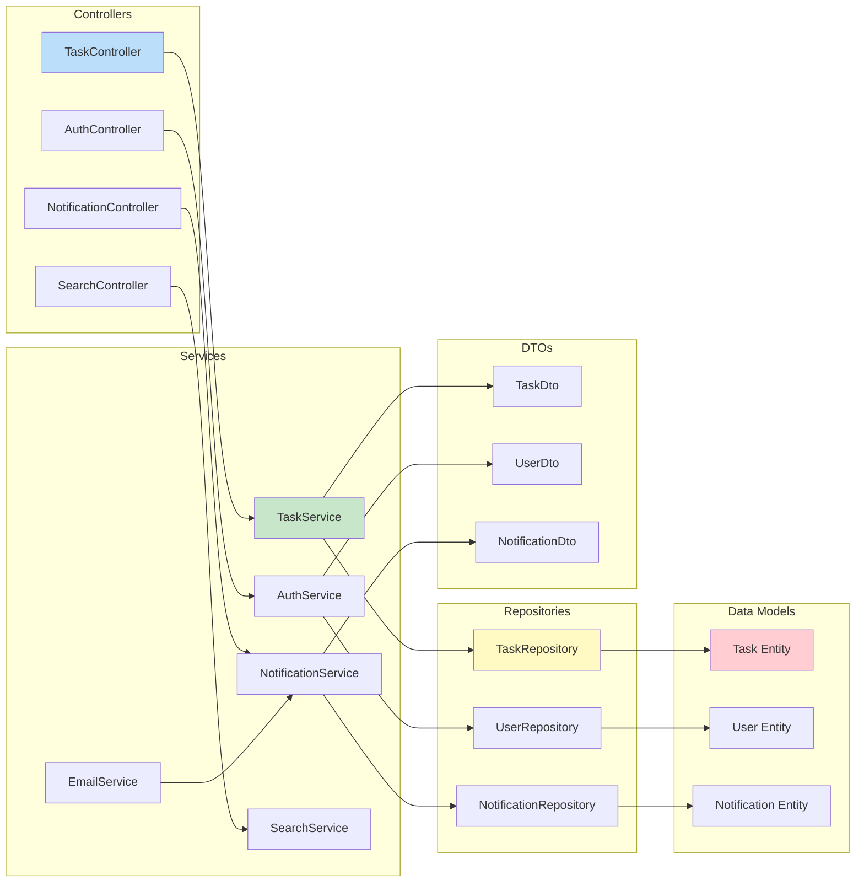
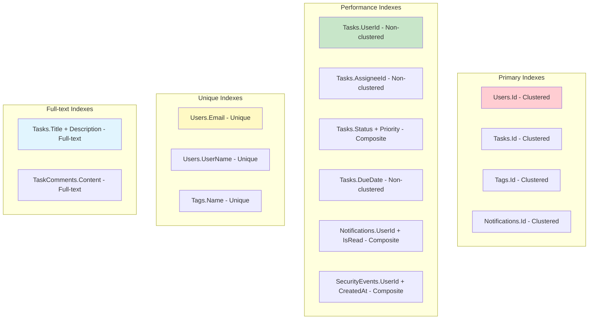
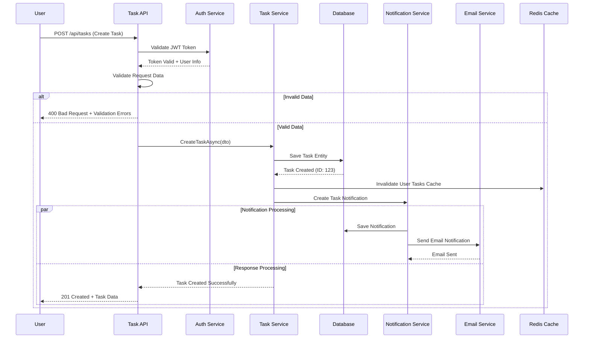
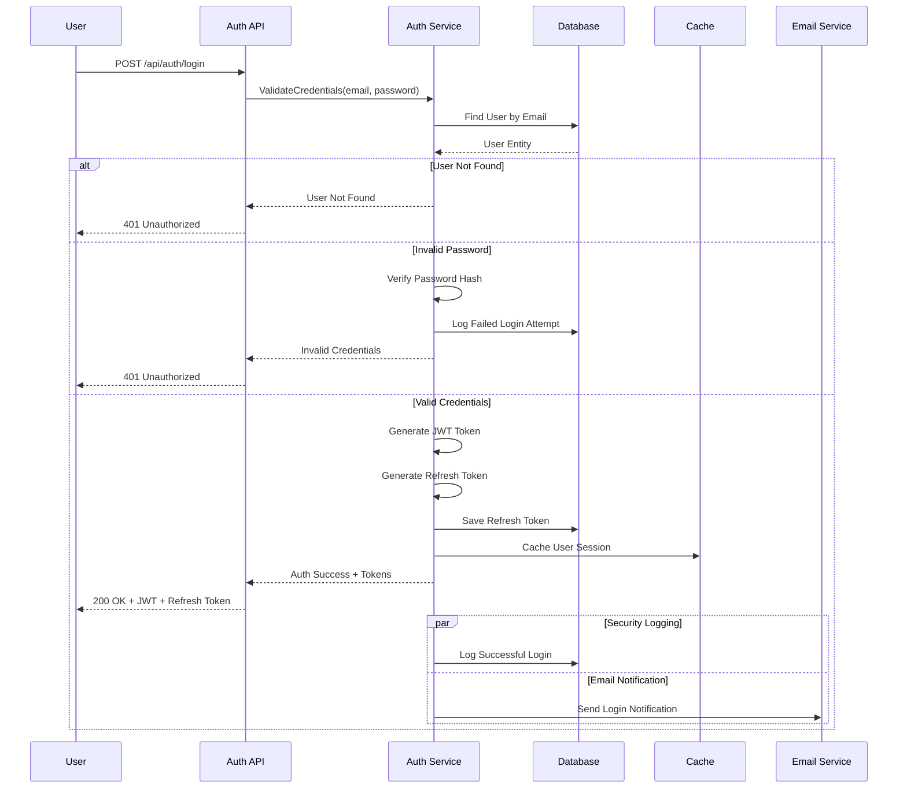
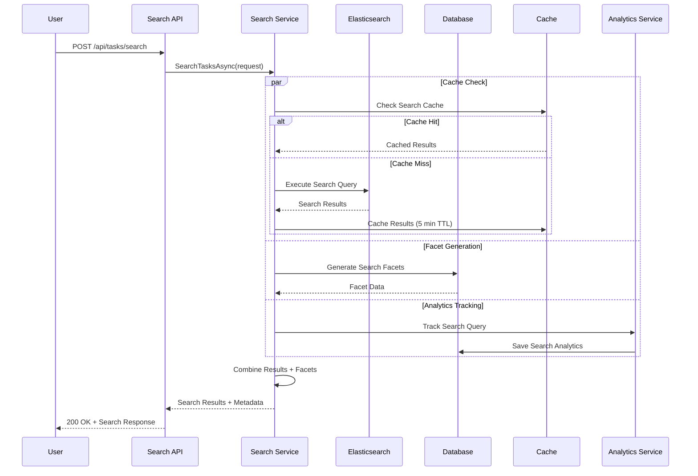
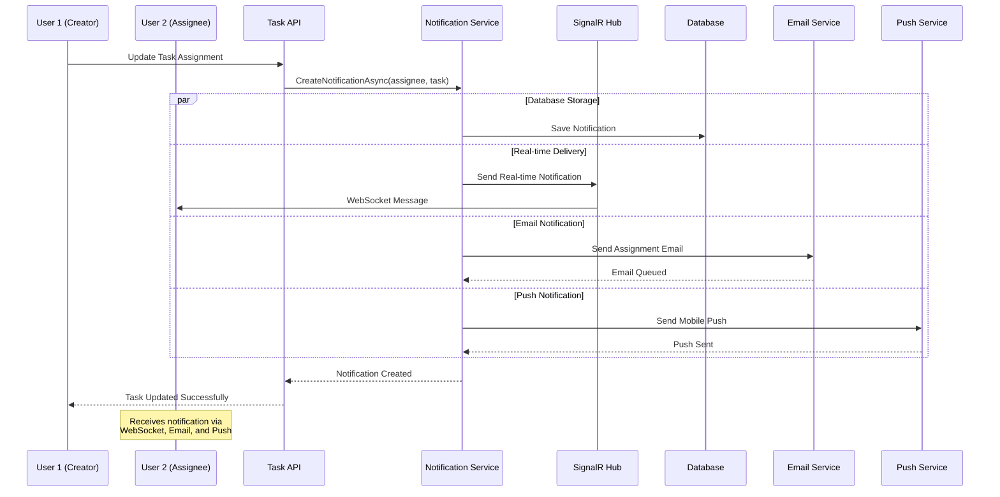
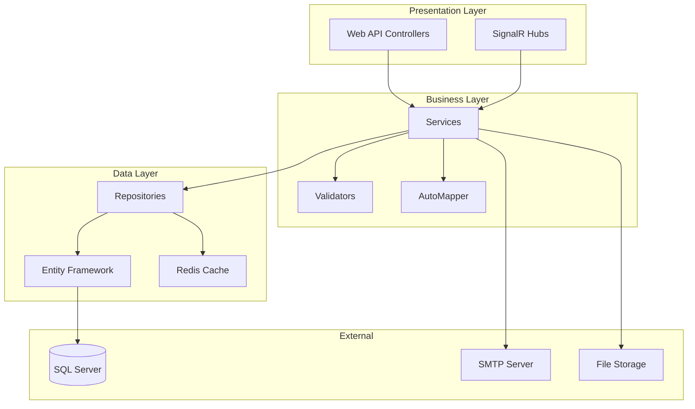

# 📚 Phase 10: Documentation & Diagrams - Complete Project Documentation

**Duration:** 35 minutes  
**Copilot Feature:** [Auto-Generated Documentation and Mermaid Diagrams](https://docs.github.com/en/copilot/using-github-copilot/getting-code-suggestions-in-your-ide-with-github-copilot)

## 🎯 Objective

Master GitHub Copilot's documentation generation capabilities to create comprehensive project documentation with Mermaid diagrams. Learn to auto-generate API documentation, architecture diagrams, user guides, and technical specifications.

## 📖 About Documentation & Diagrams with Copilot

GitHub Copilot's documentation features provide:
- **Auto-generated API documentation** - Complete endpoint documentation
- **Mermaid diagram creation** - Architecture, flow, and entity diagrams
- **Code documentation** - XML comments and inline documentation
- **User guide generation** - Step-by-step instructions and tutorials
- **Technical specification creation** - Architecture and design documents
- **README file enhancement** - Comprehensive project overviews

## 🛠️ What You'll Create

In this phase, you'll generate:
- ✅ Complete API documentation with examples
- ✅ Architecture diagrams with Mermaid
- ✅ Database schema diagrams
- ✅ Sequence diagrams for workflows
- ✅ User guides and tutorials
- ✅ Technical specifications
- ✅ Comprehensive README documentation

## 📋 Step-by-Step Instructions

### Step 1: Generate Comprehensive API Documentation 📖

**Create documentation structure:**

1. **Create documentation directories:**
   ```powershell
   # Create comprehensive documentation structure
   New-Item -Path ".\docs" -ItemType Directory -Force
   New-Item -Path ".\docs\api" -ItemType Directory -Force
   New-Item -Path ".\docs\architecture" -ItemType Directory -Force
   New-Item -Path ".\docs\guides" -ItemType Directory -Force
   New-Item -Path ".\docs\diagrams" -ItemType Directory -Force
   ```

2. **Configure XML documentation generation:**
   ```powershell
   # Update project file to generate XML documentation
   code .\src\TaskManagement.API\TaskManagement.API.csproj
   ```

3. **Add XML documentation configuration:**
   ```xml
   <PropertyGroup>
     <GenerateDocumentationFile>true</GenerateDocumentationFile>
     <DocumentationFile>.\TaskManagement.API.xml</DocumentationFile>
     <NoWarn>$(NoWarn);1591</NoWarn>
   </PropertyGroup>
   ```

4. **Open TaskController for documentation enhancement:**
   ```powershell
   # Open the main controller for documentation
   code .\src\TaskManagement.API\Controllers\TaskController.cs
   ```

5. **Use Copilot Chat to generate comprehensive controller documentation:**
   ```
   Generate comprehensive XML documentation for the TaskController with these requirements:

   Controller Documentation:
   - Complete <summary> with detailed description of controller purpose
   - <remarks> section with controller capabilities and features
   - Authentication and authorization requirements
   - Rate limiting and usage guidelines
   - Version information and compatibility notes

   Method Documentation:
   - Detailed <summary> for each action method
   - Complete <param> descriptions with validation rules
   - <returns> documentation with response format details
   - <response> tags for all possible HTTP status codes
   - <exception> documentation for all thrown exceptions
   - <example> sections with request/response samples

   Parameter Documentation:
   - Detailed descriptions for all parameters
   - Validation constraints and formats
   - Optional vs required parameter indicators
   - Default values and acceptable ranges
   - Security considerations for sensitive parameters

   Response Documentation:
   - Complete response model descriptions
   - HTTP status code meanings
   - Error response format specifications
   - Success response examples
   - Pagination details where applicable

   Please add comprehensive XML documentation to all controller methods.
   ```

6. **Apply the generated documentation:**
   - Review and apply Copilot's suggested XML documentation
   - Ensure all methods have complete documentation
   - Verify parameter and response descriptions

7. **Verify XML documentation generation:**
   ```powershell
   # Build to generate XML documentation file
   dotnet build .\src\TaskManagement.API\
   ```

**Expected enhanced controller documentation:**

```csharp
/// <summary>
/// Task Management API Controller providing comprehensive CRUD operations
/// with advanced features including search, filtering, statistics, and bulk operations.
/// </summary>
/// <remarks>
/// This controller handles all task-related operations in the Task Management System.
/// 
/// Features:
/// - Complete CRUD operations for tasks
/// - Advanced search and filtering capabilities
/// - Task statistics and analytics
/// - Bulk operations for multiple tasks
/// - Real-time notifications integration
/// - Comprehensive validation and error handling
/// 
/// Authentication: Requires JWT Bearer token
/// Rate Limiting: 100 requests per minute per user
/// Version: API v2.0
/// </remarks>
[ApiController]
[Route("api/[controller]")]
[Authorize]
public class TaskController : ControllerBase
{
    /// <summary>
    /// Retrieves all tasks for the authenticated user with optional filtering and pagination.
    /// </summary>
    /// <param name="pageNumber">The page number for pagination (default: 1, min: 1)</param>
    /// <param name="pageSize">The number of items per page (default: 10, max: 100)</param>
    /// <param name="priority">Filter by task priority (optional)</param>
    /// <param name="status">Filter by task status (optional)</param>
    /// <param name="searchQuery">Search in task titles and descriptions (optional)</param>
    /// <returns>A paginated list of tasks matching the specified criteria</returns>
    /// <response code="200">Successfully retrieved tasks</response>
    /// <response code="400">Invalid parameters provided</response>
    /// <response code="401">Authentication required</response>
    /// <response code="403">Insufficient permissions</response>
    /// <example>
    /// GET /api/tasks?pageNumber=1&amp;pageSize=10&amp;priority=High&amp;searchQuery=urgent
    /// </example>
    [HttpGet]
    [ProducesResponseType(typeof(PagedResult<TaskDto>), StatusCodes.Status200OK)]
    [ProducesResponseType(typeof(ErrorResponse), StatusCodes.Status400BadRequest)]
    public async Task<ActionResult<PagedResult<TaskDto>>> GetTasks(
        [FromQuery] int pageNumber = 1,
        [FromQuery] int pageSize = 10,
        [FromQuery] TaskPriority? priority = null,
        [FromQuery] TaskStatus? status = null,
        [FromQuery] string? searchQuery = null)
    {
        // Implementation...
    }
}
```

---

### Step 2: Create Architecture Diagrams with Mermaid 🏗️

**Generate comprehensive architecture diagrams:**

1. **Create architecture documentation file:**
   ```powershell
   # Create architecture document with Mermaid diagrams
   New-Item -Path ".\docs\architecture\system-architecture.md" -ItemType File -Force
   ```

2. **Use Copilot Chat to generate architecture diagrams:**
   ```
   Create comprehensive Mermaid diagrams for the Task Management API system architecture:

   System Architecture Diagram:
   - Show all system components and their relationships
   - Include API layer, service layer, data layer
   - Show external integrations (email service, notification service)
   - Include authentication and authorization flow
   - Show caching and performance components

   Microservices Architecture:
   - Break down into logical microservices
   - Show service boundaries and communication
   - Include API Gateway and service discovery
   - Show database per service pattern

   Data Flow Diagrams:
   - Show how data flows through the system
   - Include request/response cycles
   - Show async processing flows
   - Include error handling paths

   Infrastructure Diagram:
   - Show deployment architecture
   - Include load balancers, API servers, databases
   - Show monitoring and logging components
   - Include security boundaries

   Please create Mermaid diagrams for each architecture view.
   ```

3. **Expected architecture diagrams from Copilot:**
   ```markdown
   # Task Management API - System Architecture
   
   ## Overall System Architecture
   
   ```mermaid
   graph TB
       subgraph "Client Applications"
           WEB[Web Application]
           MOBILE[Mobile App]
           API_CLIENT[API Clients]
       end
       
       subgraph "API Gateway"
           GATEWAY[API Gateway<br/>Rate Limiting<br/>Authentication]
       end
       
       subgraph "Application Services"
           AUTH[Authentication Service]
           TASK[Task Service]
           NOTIFICATION[Notification Service]
           SEARCH[Search Service]
           REPORTING[Reporting Service]
       end
       
       subgraph "Infrastructure Services"
           CACHE[Redis Cache]
           EMAIL[Email Service]
           SMS[SMS Service]
           STORAGE[File Storage]
       end
       
       subgraph "Data Layer"
           DB[(SQL Server Database)]
           SEARCH_DB[(Elasticsearch)]
       end
       
       WEB --> GATEWAY
       MOBILE --> GATEWAY
       API_CLIENT --> GATEWAY
       
       GATEWAY --> AUTH
       GATEWAY --> TASK
       GATEWAY --> NOTIFICATION
       GATEWAY --> SEARCH
       GATEWAY --> REPORTING
       
       AUTH --> CACHE
       TASK --> DB
       TASK --> CACHE
       NOTIFICATION --> EMAIL
       NOTIFICATION --> SMS
       SEARCH --> SEARCH_DB
       REPORTING --> DB
   ```

4. **Add more specific diagrams:**
   ```powershell
   # Create specific diagram files
   New-Item -Path ".\docs\architecture\data-flow.md" -ItemType File -Force
   New-Item -Path ".\docs\architecture\sequence-diagrams.md" -ItemType File -Force
   ```

---

### Step 3: Create Database Schema Diagrams 🗄️

**Generate database documentation with diagrams:**

1. **Create database documentation file:**
   ```powershell
   # Create database schema documentation
   New-Item -Path ".\docs\database\schema.md" -ItemType File -Force
   ```

2. **Use Copilot Chat for database diagrams:**
   ```
   Create comprehensive Mermaid database diagrams for the Task Management system:

   Entity Relationship Diagram (ERD):
   - Show all database tables and relationships
   - Include primary keys, foreign keys, and indexes
   - Show cardinality between entities
   - Include data types for key fields

   Database Schema Diagram:
   - Visual representation of table structures
   - Show column details and constraints
   - Include triggers, stored procedures, views
   - Show partitioning and indexing strategies

   Data Model Diagram:
   - Conceptual data model
   - Show business entities and relationships
   - Include domain constraints and business rules
   - Show data lineage and transformation flows

   Please create detailed Mermaid diagrams for the database design.
   ```

3. **Expected database diagrams:**
   ```markdown
   # Database Schema Documentation
   
   ## Entity Relationship Diagram
   
   ```mermaid
   erDiagram
       Users ||--o{ Tasks : creates
       Users ||--o{ TaskComments : authors
       Tasks ||--o{ TaskComments : has
       Tasks }o--|| Categories : belongs_to
       Users ||--o{ UserRoles : has
       UserRoles }o--|| Roles : references
       Tasks ||--o{ TaskTags : has
       TaskTags }o--|| Tags : references
       Tasks ||--o{ TaskAttachments : contains
       
       Users {
           int Id PK
           string Username UK
           string Email UK
           string PasswordHash
           datetime CreatedAt
           datetime LastLoginAt
           bool IsActive
           string FirstName
           string LastName
       }
       
       Tasks {
           int Id PK
           string Title
           text Description
           int UserId FK
           int CategoryId FK
           enum Priority
           enum Status
           datetime CreatedAt
           datetime UpdatedAt
           datetime DueDate
           datetime CompletedAt
           bool IsCompleted
       }
       
       TaskComments {
           int Id PK
           int TaskId FK
           int UserId FK
           text Content
           datetime CreatedAt
           datetime UpdatedAt
       }
       
       Categories {
           int Id PK
           string Name UK
           string Description
           string Color
           int UserId FK
       }
   ```

---

### Step 4: Create Sequence Diagrams for Workflows 🔄

**Generate workflow sequence diagrams:**

1. **Create workflow documentation:**
   ```powershell
   # Create workflow documentation file
   New-Item -Path ".\docs\workflows\api-workflows.md" -ItemType File -Force
   ```

2. **Use Copilot Chat for sequence diagrams:**
   ```
   Create detailed Mermaid sequence diagrams for key workflows in the Task Management API:

   User Authentication Flow:
   - User registration with email verification
   - User login with JWT token generation
   - Token refresh workflow
   - Password reset process

   Task Management Workflows:
   - Task creation with validation and notifications
   - Task update with conflict resolution
   - Task completion with notifications
   - Task deletion with cascade effects

   Search and Filtering Workflow:
   - Advanced search with faceted results
   - Auto-complete suggestions
   - Search result caching

   Notification Workflows:
   - Real-time notification delivery via SignalR
   - Email notification processing
   - Bulk notification processing

   Error Handling Workflows:
   - Validation error processing
   - Exception handling and logging
   - Retry mechanisms for external services

   Please create comprehensive sequence diagrams for each workflow.
   ```

3. **Expected sequence diagrams:**
   ```markdown
   # API Workflow Sequence Diagrams
   
   ## Task Creation Workflow
   
   ```mermaid
   sequenceDiagram
       participant Client
       participant API Gateway
       participant Auth Service
       participant Task Service
       participant Database
       participant Notification Service
       participant Email Service
       
       Client->>API Gateway: POST /api/tasks
       API Gateway->>Auth Service: Validate JWT Token
       Auth Service->>API Gateway: Token Valid
       API Gateway->>Task Service: Create Task Request
       
       Task Service->>Task Service: Validate Input
       Task Service->>Database: Check User Exists
       Database->>Task Service: User Found
       
       Task Service->>Database: Save Task
       Database->>Task Service: Task Created
       
       Task Service->>Notification Service: Send Creation Notification
       Notification Service->>Email Service: Send Email
       Email Service->>Notification Service: Email Sent
       
       Task Service->>API Gateway: Task Created Response
       API Gateway->>Client: 201 Created with Task Data
   ```

---

### Step 5: Generate User Guides and Tutorials 📖

**Create comprehensive user documentation:**

1. **Create user guide structure:**
   ```powershell
   # Create user documentation directories
   New-Item -Path ".\docs\guides\user-guide.md" -ItemType File -Force
   New-Item -Path ".\docs\guides\api-reference.md" -ItemType File -Force
   New-Item -Path ".\docs\guides\developer-guide.md" -ItemType File -Force
   ```

2. **Use Copilot Chat for user guide generation:**
   ```
   Create comprehensive user documentation for the Task Management API:

   User Guide Content:
   - Getting started tutorial with step-by-step instructions
   - Authentication and API key setup
   - Common use cases with code examples
   - Troubleshooting section with FAQ
   - Best practices and performance tips

   API Reference Guide:
   - Complete endpoint documentation with examples
   - Request/response formats for all endpoints
   - Error codes and troubleshooting
   - Rate limiting and pagination details
   - Authentication requirements

   Developer Guide:
   - Local development setup instructions
   - Environment configuration
   - Testing strategies and tools
   - Deployment procedures
   - Contributing guidelines

   Tutorial Sections:
   - Quick start in 5 minutes
   - Building your first integration
   - Advanced features walkthrough
   - Performance optimization guide
   - Security best practices

   Please create detailed markdown documentation for each section.
   ```

3. **Apply user guide content:**
   - Review and apply Copilot's generated documentation
   - Ensure step-by-step tutorials are clear and actionable
   - Include code examples and screenshots where applicable

---

### Step 6: Create Technical Specifications 📋

**Generate detailed technical documentation:**

1. **Create technical specification files:**
   ```powershell
   # Create technical documentation
   New-Item -Path ".\docs\technical\api-specification.md" -ItemType File -Force
   New-Item -Path ".\docs\technical\security-specification.md" -ItemType File -Force
   New-Item -Path ".\docs\technical\performance-requirements.md" -ItemType File -Force
   ```

2. **Use Copilot Chat for technical specifications:**
   ```
   Create detailed technical specifications for the Task Management API:

   API Specification:
   - OpenAPI 3.0 specification with complete schemas
   - Detailed request/response models
   - Authentication mechanisms and security schemes
   - Error handling specifications
   - Rate limiting and throttling policies

   Security Specification:
   - Authentication and authorization mechanisms
   - Data encryption requirements
   - API security best practices
   - Vulnerability assessment procedures
   - Security monitoring and alerting

   Performance Requirements:
   - Response time SLAs for all endpoints
   - Throughput requirements and scaling plans
   - Database performance specifications
   - Caching strategies and implementation
   - Monitoring and alerting thresholds

   Architecture Specifications:
   - System architecture patterns and principles
   - Component interaction specifications
   - Data flow and processing requirements
   - Integration specifications for external services
   - Deployment and infrastructure requirements

   Please create comprehensive technical documentation for each area.
   ```

---

### Step 7: Generate README Documentation 📄

**Create comprehensive project README:**

1. **Update the main README file:**
   ```powershell
   # Create comprehensive README
   code .\README.md
   ```

2. **Use Copilot Chat for README generation:**
   ```
   Create a comprehensive README.md for the Task Management API project with:

   Project Overview:
   - Clear project description and purpose
   - Key features and capabilities
   - Technology stack and dependencies
   - Architecture overview with diagrams

   Getting Started:
   - Prerequisites and system requirements
   - Step-by-step installation instructions
   - Configuration setup and environment variables
   - Quick start guide with examples

   API Documentation:
   - Authentication setup and usage
   - Core endpoint examples with curl commands
   - Response format specifications
   - Error handling examples

   Development Setup:
   - Local development environment setup
   - Database migration and seeding
   - Running tests and code coverage
   - Debugging and troubleshooting

   Deployment:
   - Production deployment instructions
   - Environment configuration
   - Monitoring and logging setup
   - Performance optimization tips

   Contributing:
   - Code contribution guidelines
   - Pull request process
   - Code style and standards
   - Issue reporting guidelines

   Additional Sections:
   - License information
   - Changelog and versioning
   - Support and contact information
   - Acknowledgments and credits

   Include badges for build status, coverage, version, etc.
   Use proper markdown formatting with tables, code blocks, and diagrams.
   ```

3. **Apply comprehensive README content:**
   - Review and apply Copilot's generated README content
   - Add project badges and shields
   - Include proper markdown formatting and structure

---

### Step 8: Documentation Integration and Automation 🔄

**Set up automated documentation workflows:**

1. **Create documentation automation scripts:**
   ```powershell
   # Create documentation build scripts
   New-Item -Path ".\scripts\build-docs.ps1" -ItemType File -Force
   New-Item -Path ".\scripts\validate-docs.ps1" -ItemType File -Force
   ```

2. **Use Copilot Chat for documentation automation:**
   ```
   Create PowerShell scripts for documentation automation:

   Documentation Build Script (build-docs.ps1):
   - Generate API documentation from XML comments
   - Build Swagger/OpenAPI specifications
   - Generate PDF versions of markdown documents
   - Create documentation website with MkDocs or similar
   - Validate all markdown files and links

   Documentation Validation Script (validate-docs.ps1):
   - Check for broken links in documentation
   - Validate Mermaid diagram syntax
   - Ensure code examples are up-to-date
   - Check documentation completeness
   - Generate documentation coverage reports

   GitHub Actions Workflow:
   - Automated documentation building on commits
   - Documentation deployment to GitHub Pages
   - Link checking and validation
   - Notification on documentation issues

   Documentation Standards:
   - Markdown linting rules
   - Diagram naming conventions
   - Code example formatting standards
   - Documentation review checklist

   Please create complete automation scripts and workflows.
   ```

3. **Set up GitHub Actions for documentation:**
   ```powershell
   # Create GitHub Actions workflow
   New-Item -Path ".\.github\workflows\docs.yml" -ItemType File -Force
   ```

4. **Verify complete documentation suite:**
   ```powershell
   # Build and validate all documentation
   .\scripts\build-docs.ps1
   .\scripts\validate-docs.ps1
   
   # Generate final documentation report
   Write-Host "Documentation Status:" -ForegroundColor Green
   Get-ChildItem -Path ".\docs" -Recurse -Include "*.md" | Measure-Object | Select-Object Count
   ```
    /// <returns>Paginated list of user's tasks</returns>
    /// <response code="200">Returns the paginated list of tasks</response>
    /// <response code="400">Invalid pagination or filter parameters</response>
    /// <response code="401">User is not authenticated</response>
    /// <response code="500">Internal server error occurred</response>
    /// <example>
    /// GET /api/tasks?page=1&amp;pageSize=10&amp;sortBy=dueDate&amp;sortDirection=asc&amp;status=New
    /// 
    /// Response:
    /// {
    ///   "success": true,
    ///   "data": {
    ///     "items": [
    ///       {
    ///         "id": 1,
    ///         "title": "Complete project documentation",
    ///         "description": "Write comprehensive API documentation",
    ///         "priority": "High",
    ///         "status": "New",
    ///         "dueDate": "2024-12-31T23:59:59Z",
    ///         "createdAt": "2024-01-15T10:30:00Z",
    ///         "assigneeName": "John Doe",
    ///         "tags": ["documentation", "api"]
    ///       }
    ///     ],
    ///     "totalCount": 25,
    ///     "page": 1,
    ///     "pageSize": 10,
    ///     "totalPages": 3
    ///   },
    ///   "message": "Tasks retrieved successfully",
    ///   "timestamp": "2024-01-15T10:30:00Z"
    /// }
    /// </example>
    [HttpGet]
    [ProducesResponseType(typeof(ApiResponse<PagedResult<TaskDto>>), StatusCodes.Status200OK)]
    [ProducesResponseType(typeof(ApiResponse<string>), StatusCodes.Status400BadRequest)]
    public async Task<ActionResult<ApiResponse<PagedResult<TaskDto>>>> GetTasks(
        [FromQuery] int page = 1,
        [FromQuery] int pageSize = 20,
        [FromQuery] string sortBy = "createdAt",
        [FromQuery] string sortDirection = "desc",
        [FromQuery] TaskStatus? status = null,
        [FromQuery] TaskPriority? priority = null)
    {
        // Implementation...
    }

    /// <summary>
    /// Creates a new task for the authenticated user
    /// </summary>
    /// <param name="createDto">Task creation data</param>
    /// <returns>The created task with generated ID and metadata</returns>
    /// <response code="201">Task created successfully</response>
    /// <response code="400">Invalid task data provided</response>
    /// <response code="401">User is not authenticated</response>
    /// <response code="422">Validation failed for the provided data</response>
    /// <response code="500">Internal server error occurred</response>
    /// <example>
    /// POST /api/tasks
    /// 
    /// Request Body:
    /// {
    ///   "title": "Complete project documentation",
    ///   "description": "Write comprehensive API documentation with examples",
    ///   "priority": "High",
    ///   "dueDate": "2024-12-31T23:59:59Z",
    ///   "assigneeId": 1,
    ///   "tags": ["documentation", "api"]
    /// }
    /// 
    /// Response:
    /// {
    ///   "success": true,
    ///   "data": {
    ///     "id": 123,
    ///     "title": "Complete project documentation",
    ///     "description": "Write comprehensive API documentation with examples",
    ///     "priority": "High",
    ///     "status": "New",
    ///     "dueDate": "2024-12-31T23:59:59Z",
    ///     "createdAt": "2024-01-15T10:30:00Z",
    ///     "assigneeName": "John Doe",
    ///     "tags": ["documentation", "api"]
    ///   },
    ///   "message": "Task created successfully",
    ///   "timestamp": "2024-01-15T10:30:00Z"
    /// }
    /// </example>
    [HttpPost]
    [ProducesResponseType(typeof(ApiResponse<TaskDto>), StatusCodes.Status201Created)]
    [ProducesResponseType(typeof(ApiResponse<ValidationResult>), StatusCodes.Status400BadRequest)]
    [ProducesResponseType(typeof(ApiResponse<ValidationResult>), StatusCodes.Status422UnprocessableEntity)]
    public async Task<ActionResult<ApiResponse<TaskDto>>> CreateTask([FromBody] CreateTaskDto createDto)
    {
        // Implementation...
    }

    /// <summary>
    /// Retrieves a specific task by its unique identifier
    /// </summary>
    /// <param name="id">The unique identifier of the task</param>
    /// <returns>The task details if found and accessible by the user</returns>
    /// <response code="200">Task found and returned successfully</response>
    /// <response code="400">Invalid task ID format</response>
    /// <response code="401">User is not authenticated</response>
    /// <response code="403">User does not have access to this task</response>
    /// <response code="404">Task with the specified ID was not found</response>
    /// <response code="500">Internal server error occurred</response>
    [HttpGet("{id}")]
    [ProducesResponseType(typeof(ApiResponse<TaskDto>), StatusCodes.Status200OK)]
    [ProducesResponseType(typeof(ApiResponse<string>), StatusCodes.Status400BadRequest)]
    [ProducesResponseType(typeof(ApiResponse<string>), StatusCodes.Status403Forbidden)]
    [ProducesResponseType(typeof(ApiResponse<string>), StatusCodes.Status404NotFound)]
    public async Task<ActionResult<ApiResponse<TaskDto>>> GetTask(
        [FromRoute] int id)
    {
        // Implementation...
    }

    /// <summary>
    /// Performs advanced search across tasks with filtering and faceted search
    /// </summary>
    /// <param name="query">Search query to match against title, description, and tags</param>
    /// <param name="filters">Advanced filters for priority, status, assignee, and date ranges</param>
    /// <param name="page">Page number for pagination</param>
    /// <param name="pageSize">Number of results per page</param>
    /// <param name="sortBy">Field to sort results by</param>
    /// <param name="sortDirection">Sort direction (asc or desc)</param>
    /// <returns>Search results with facets and pagination metadata</returns>
    /// <response code="200">Search completed successfully</response>
    /// <response code="400">Invalid search parameters</response>
    /// <response code="401">User is not authenticated</response>
    /// <response code="500">Search service unavailable</response>
    /// <example>
    /// POST /api/tasks/search
    /// 
    /// Request Body:
    /// {
    ///   "query": "documentation",
    ///   "filters": [
    ///     {
    ///       "field": "priority",
    ///       "values": ["High", "Medium"]
    ///     },
    ///     {
    ///       "field": "status",
    ///       "values": ["New", "InProgress"]
    ///     }
    ///   ],
    ///   "dateFrom": "2024-01-01T00:00:00Z",
    ///   "dateTo": "2024-12-31T23:59:59Z",
    ///   "page": 1,
    ///   "pageSize": 20,
    ///   "sortBy": "relevance",
    ///   "sortDirection": "desc"
    /// }
    /// </example>
    [HttpPost("search")]
    [ProducesResponseType(typeof(ApiResponse<SearchResult<TaskDto>>), StatusCodes.Status200OK)]
    [ProducesResponseType(typeof(ApiResponse<string>), StatusCodes.Status400BadRequest)]
    public async Task<ActionResult<ApiResponse<SearchResult<TaskDto>>>> SearchTasks(
        [FromBody] SearchRequest request)
    {
        // Implementation...
    }
}
```

### Step 2: Create Architecture Diagrams with Mermaid 🏗️

**Generate system architecture diagram:**

```markdown
# System Architecture

## Overview Architecture Diagram



## Component Architecture


```

### Step 3: Generate Database Schema Diagrams 🗄️

**Create Entity Relationship Diagram:**

```markdown
# Database Schema

## Entity Relationship Diagram

```mermaid
erDiagram
    Users ||--o{ Tasks : "creates/owns"
    Users ||--o{ Notifications : "receives"
    Users ||--o{ TaskAssignments : "assigned_to"
    Tasks ||--o{ TaskTags : "has"
    Tags ||--o{ TaskTags : "applied_to"
    Tasks ||--o{ TaskComments : "has"
    Users ||--o{ TaskComments : "writes"
    Tasks ||--o{ TaskAttachments : "has"
    Users ||--o{ SecurityEvents : "triggers"

    Users {
        string Id PK "GUID"
        string FirstName "NOT NULL"
        string LastName "NOT NULL"
        string Email "UNIQUE, NOT NULL"
        string UserName "UNIQUE, NOT NULL"
        string PasswordHash "NOT NULL"
        bool EmailConfirmed "DEFAULT FALSE"
        string PhoneNumber "NULLABLE"
        datetime CreatedAt "NOT NULL"
        datetime UpdatedAt "NULLABLE"
        bool IsActive "DEFAULT TRUE"
        string Role "DEFAULT 'User'"
    }

    Tasks {
        int Id PK "IDENTITY"
        string Title "NOT NULL, MAX 200"
        string Description "NULLABLE, MAX 2000"
        int Priority "ENUM: Low=1, Medium=2, High=3"
        int Status "ENUM: New=1, InProgress=2, Completed=3"
        string UserId FK "Creator"
        string AssigneeId FK "NULLABLE, Assigned User"
        datetime CreatedAt "NOT NULL"
        datetime UpdatedAt "NULLABLE"
        datetime DueDate "NULLABLE"
        datetime CompletedAt "NULLABLE"
        bool IsCompleted "COMPUTED"
        decimal EstimatedHours "NULLABLE"
        decimal ActualHours "NULLABLE"
    }

    Tags {
        int Id PK "IDENTITY"
        string Name "UNIQUE, NOT NULL, MAX 50"
        string Color "NULLABLE, HEX Color"
        string Description "NULLABLE, MAX 200"
        datetime CreatedAt "NOT NULL"
        bool IsActive "DEFAULT TRUE"
    }

    TaskTags {
        int TaskId PK FK
        int TagId PK FK
        datetime CreatedAt "NOT NULL"
    }

    TaskComments {
        int Id PK "IDENTITY"
        int TaskId FK "NOT NULL"
        string UserId FK "NOT NULL"
        string Content "NOT NULL, MAX 1000"
        datetime CreatedAt "NOT NULL"
        datetime UpdatedAt "NULLABLE"
        bool IsDeleted "DEFAULT FALSE"
    }

    TaskAttachments {
        int Id PK "IDENTITY"
        int TaskId FK "NOT NULL"
        string FileName "NOT NULL, MAX 255"
        string OriginalFileName "NOT NULL, MAX 255"
        string ContentType "NOT NULL, MAX 100"
        long FileSize "NOT NULL"
        string BlobUrl "NOT NULL, MAX 500"
        datetime UploadedAt "NOT NULL"
        string UploadedBy FK "NOT NULL"
    }

    Notifications {
        int Id PK "IDENTITY"
        string UserId FK "NOT NULL"
        string Title "NOT NULL, MAX 200"
        string Message "NOT NULL, MAX 1000"
        int Type "ENUM: Info=1, Warning=2, Error=3, Success=4"
        bool IsRead "DEFAULT FALSE"
        datetime CreatedAt "NOT NULL"
        datetime ReadAt "NULLABLE"
        string RelatedEntityType "NULLABLE"
        string RelatedEntityId "NULLABLE"
    }

    SecurityEvents {
        int Id PK "IDENTITY"
        string UserId FK "NULLABLE"
        int Type "ENUM: Login=1, Logout=2, PasswordChange=3, FailedLogin=4"
        string Description "NOT NULL, MAX 500"
        string IpAddress "NOT NULL, MAX 45"
        string UserAgent "NULLABLE, MAX 500"
        datetime CreatedAt "NOT NULL"
        string Metadata "NULLABLE, JSON"
    }
```

## Database Indexes


```

### Step 4: Create Workflow Sequence Diagrams 🔄

**Generate user workflow diagrams:**

```markdown
# Workflow Diagrams

## Task Creation Workflow



## User Authentication Flow



## Search and Analytics Workflow



## Real-time Notification Flow


```

### Step 5: Generate User Guides and Tutorials 📚

**Create comprehensive user documentation:**

```markdown
# User Guide

## Getting Started with Task Management API

### Prerequisites

Before you begin, ensure you have:
- .NET 8 SDK installed
- SQL Server or SQL Server Express
- Redis server (for caching)
- An SMTP server for email notifications
- Visual Studio 2022 or VS Code

### Quick Start

#### 1. Installation

```bash
# Clone the repository
git clone https://github.com/yourorg/task-management-api.git
cd task-management-api

# Restore dependencies
dotnet restore

# Update database
dotnet ef database update

# Run the application
dotnet run --project TaskManagement.API
```

#### 2. Configuration

Update `appsettings.json` with your settings:

```json
{
  "ConnectionStrings": {
    "DefaultConnection": "Server=(localdb)\\mssqllocaldb;Database=TaskManagementDb;Trusted_Connection=true;"
  },
  "Jwt": {
    "Key": "your-super-secret-key-here",
    "Issuer": "TaskManagementAPI",
    "Audience": "TaskManagementUsers",
    "ExpiryMinutes": 60
  },
  "Redis": {
    "ConnectionString": "localhost:6379"
  },
  "Smtp": {
    "Host": "smtp.gmail.com",
    "Port": 587,
    "Username": "your-email@gmail.com",
    "Password": "your-app-password",
    "FromEmail": "noreply@taskmanagement.com"
  }
}
```

#### 3. First API Call

1. **Register a new user:**
```bash
curl -X POST "https://localhost:7001/api/auth/register" \
     -H "Content-Type: application/json" \
     -d '{
       "firstName": "John",
       "lastName": "Doe",
       "email": "john.doe@example.com",
       "password": "SecurePassword123!"
     }'
```

2. **Login to get JWT token:**
```bash
curl -X POST "https://localhost:7001/api/auth/login" \
     -H "Content-Type: application/json" \
     -d '{
       "email": "john.doe@example.com",
       "password": "SecurePassword123!"
     }'
```

3. **Create your first task:**
```bash
curl -X POST "https://localhost:7001/api/tasks" \
     -H "Content-Type: application/json" \
     -H "Authorization: Bearer YOUR_JWT_TOKEN" \
     -d '{
       "title": "My First Task",
       "description": "This is my first task created via API",
       "priority": "Medium",
       "dueDate": "2024-12-31T23:59:59Z"
     }'
```

### API Usage Examples

#### Task Management

**Create a Task:**
```javascript
const response = await fetch('/api/tasks', {
  method: 'POST',
  headers: {
    'Content-Type': 'application/json',
    'Authorization': 'Bearer ' + token
  },
  body: JSON.stringify({
    title: 'Complete project documentation',
    description: 'Write comprehensive API documentation with examples',
    priority: 'High',
    dueDate: '2024-12-31T23:59:59Z',
    tags: ['documentation', 'api']
  })
});

const result = await response.json();
console.log('Task created:', result.data);
```

**Search Tasks:**
```javascript
const searchRequest = {
  query: 'documentation',
  filters: [
    {
      field: 'priority',
      values: ['High', 'Medium']
    }
  ],
  page: 1,
  pageSize: 20,
  sortBy: 'dueDate',
  sortDirection: 'asc'
};

const response = await fetch('/api/tasks/search', {
  method: 'POST',
  headers: {
    'Content-Type': 'application/json',
    'Authorization': 'Bearer ' + token
  },
  body: JSON.stringify(searchRequest)
});

const searchResults = await response.json();
console.log('Found tasks:', searchResults.data.items);
```

#### Authentication Examples

**Register New User:**
```python
import requests

registration_data = {
    "firstName": "Jane",
    "lastName": "Smith",
    "email": "jane.smith@example.com",
    "password": "SecurePassword123!",
    "confirmPassword": "SecurePassword123!"
}

response = requests.post(
    "https://localhost:7001/api/auth/register",
    json=registration_data
)

if response.status_code == 201:
    print("User registered successfully")
    user_data = response.json()
    print(f"User ID: {user_data['data']['id']}")
else:
    print("Registration failed:", response.json())
```

**Handle Token Refresh:**
```csharp
public async Task<string> RefreshTokenAsync(string refreshToken)
{
    var request = new RefreshTokenRequest { RefreshToken = refreshToken };
    
    var response = await _httpClient.PostAsJsonAsync("/api/auth/refresh", request);
    
    if (response.IsSuccessStatusCode)
    {
        var result = await response.Content.ReadFromJsonAsync<ApiResponse<AuthResult>>();
        return result.Data.Token;
    }
    
    throw new UnauthorizedAccessException("Token refresh failed");
}
```

### Error Handling

The API uses standard HTTP status codes and provides detailed error information:

#### Common Error Responses

**400 Bad Request - Validation Error:**
```json
{
  "success": false,
  "message": "Validation failed",
  "errors": [
    "Title is required",
    "Title cannot exceed 200 characters"
  ],
  "timestamp": "2024-01-15T10:30:00Z"
}
```

**401 Unauthorized - Authentication Required:**
```json
{
  "success": false,
  "message": "Authentication required",
  "errors": ["Invalid or expired token"],
  "timestamp": "2024-01-15T10:30:00Z"
}
```

**404 Not Found - Resource Not Found:**
```json
{
  "success": false,
  "message": "Task not found",
  "errors": ["Task with ID 123 was not found"],
  "timestamp": "2024-01-15T10:30:00Z"
}
```

#### Error Handling Best Practices

1. **Always check response status:**
```javascript
if (!response.ok) {
  const error = await response.json();
  throw new Error(error.message || 'API request failed');
}
```

2. **Handle rate limiting:**
```javascript
if (response.status === 429) {
  const retryAfter = response.headers.get('Retry-After');
  console.log(`Rate limited. Retry after ${retryAfter} seconds`);
}
```

3. **Implement retry logic:**
```javascript
async function apiCallWithRetry(url, options, maxRetries = 3) {
  for (let i = 0; i < maxRetries; i++) {
    try {
      const response = await fetch(url, options);
      if (response.ok) return response;
      
      if (response.status >= 500 && i < maxRetries - 1) {
        await new Promise(resolve => setTimeout(resolve, 1000 * Math.pow(2, i)));
        continue;
      }
      
      throw new Error(`HTTP ${response.status}: ${response.statusText}`);
    } catch (error) {
      if (i === maxRetries - 1) throw error;
    }
  }
}
```

### Performance Optimization

#### Caching Strategy

1. **Use appropriate cache headers:**
```javascript
// For frequently accessed, rarely changing data
fetch('/api/tasks/statistics', {
  headers: {
    'Cache-Control': 'max-age=300' // Cache for 5 minutes
  }
});
```

2. **Implement client-side caching:**
```javascript
class ApiCache {
  constructor(ttl = 300000) { // 5 minutes default
    this.cache = new Map();
    this.ttl = ttl;
  }
  
  set(key, data) {
    this.cache.set(key, {
      data,
      timestamp: Date.now()
    });
  }
  
  get(key) {
    const item = this.cache.get(key);
    if (!item) return null;
    
    if (Date.now() - item.timestamp > this.ttl) {
      this.cache.delete(key);
      return null;
    }
    
    return item.data;
  }
}
```

#### Pagination Best Practices

```javascript
// Efficient pagination for large datasets
async function getAllTasks() {
  const allTasks = [];
  let page = 1;
  const pageSize = 100; // Larger page size for efficiency
  
  while (true) {
    const response = await fetch(`/api/tasks?page=${page}&pageSize=${pageSize}`);
    const result = await response.json();
    
    allTasks.push(...result.data.items);
    
    if (page >= result.data.totalPages) break;
    page++;
  }
  
  return allTasks;
}
```

### Troubleshooting

#### Common Issues and Solutions

**Issue: "Database connection failed"**
- Check connection string in appsettings.json
- Ensure SQL Server is running
- Verify database exists and user has permissions

**Issue: "Redis connection failed"**
- Check Redis server is running: `redis-cli ping`
- Verify Redis connection string
- Check firewall settings

**Issue: "Email notifications not working"**
- Verify SMTP settings
- Check if using app-specific password for Gmail
- Review email service logs

**Issue: "JWT token expired too quickly"**
- Adjust `ExpiryMinutes` in JWT configuration
- Implement token refresh mechanism
- Check system clock synchronization

### SDK and Integration Examples

#### .NET Client SDK

```csharp
public class TaskManagementClient
{
    private readonly HttpClient _httpClient;
    private readonly string _baseUrl;
    private string _token;

    public TaskManagementClient(string baseUrl)
    {
        _baseUrl = baseUrl;
        _httpClient = new HttpClient();
    }

    public async Task<bool> LoginAsync(string email, string password)
    {
        var loginRequest = new { email, password };
        var response = await _httpClient.PostAsJsonAsync($"{_baseUrl}/api/auth/login", loginRequest);
        
        if (response.IsSuccessStatusCode)
        {
            var result = await response.Content.ReadFromJsonAsync<ApiResponse<AuthResult>>();
            _token = result.Data.Token;
            _httpClient.DefaultRequestHeaders.Authorization = 
                new System.Net.Http.Headers.AuthenticationHeaderValue("Bearer", _token);
            return true;
        }
        
        return false;
    }

    public async Task<TaskDto> CreateTaskAsync(CreateTaskDto task)
    {
        var response = await _httpClient.PostAsJsonAsync($"{_baseUrl}/api/tasks", task);
        response.EnsureSuccessStatusCode();
        
        var result = await response.Content.ReadFromJsonAsync<ApiResponse<TaskDto>>();
        return result.Data;
    }
}
```

#### Python Client SDK

```python
import requests
from typing import Optional, List, Dict

class TaskManagementClient:
    def __init__(self, base_url: str):
        self.base_url = base_url.rstrip('/')
        self.session = requests.Session()
        self.token = None

    def login(self, email: str, password: str) -> bool:
        response = self.session.post(
            f"{self.base_url}/api/auth/login",
            json={"email": email, "password": password}
        )
        
        if response.status_code == 200:
            result = response.json()
            self.token = result['data']['token']
            self.session.headers.update({
                'Authorization': f'Bearer {self.token}'
            })
            return True
        
        return False

    def create_task(self, task_data: Dict) -> Dict:
        response = self.session.post(
            f"{self.base_url}/api/tasks",
            json=task_data
        )
        response.raise_for_status()
        return response.json()['data']

    def get_tasks(self, page: int = 1, page_size: int = 20) -> Dict:
        params = {"page": page, "pageSize": page_size}
        response = self.session.get(
            f"{self.base_url}/api/tasks",
            params=params
        )
        response.raise_for_status()
        return response.json()['data']
```
```

### Step 6: Create Technical Specifications 📋

**Generate comprehensive technical documentation:**

```markdown
# Technical Specifications

## System Requirements

### Minimum Requirements
- **OS:** Windows 10/11, Linux (Ubuntu 20.04+), macOS 12+
- **Runtime:** .NET 8.0 Runtime
- **Memory:** 2 GB RAM minimum, 4 GB recommended
- **Storage:** 500 MB for application, additional space for database
- **Database:** SQL Server 2019+, PostgreSQL 13+, or SQLite (dev only)

### Production Requirements
- **OS:** Windows Server 2019+, Linux (Ubuntu 20.04 LTS+)
- **Runtime:** .NET 8.0 Runtime + ASP.NET Core Runtime
- **Memory:** 8 GB RAM minimum, 16 GB recommended
- **CPU:** 4 cores minimum, 8 cores recommended
- **Storage:** 10 GB minimum, SSD recommended
- **Database:** SQL Server 2019+ or PostgreSQL 13+ with dedicated server
- **Cache:** Redis 6.0+ with dedicated server
- **Load Balancer:** NGINX, IIS, or cloud load balancer

## API Specifications

### Authentication
- **Type:** JWT Bearer Token
- **Algorithm:** HS256
- **Token Lifetime:** 60 minutes (configurable)
- **Refresh Token:** 7 days (configurable)
- **Rate Limiting:** 100 requests/minute per user

### Response Format
All API responses follow the standardized format:

```json
{
  "success": boolean,
  "data": object | array | null,
  "message": string,
  "errors": string[],
  "meta": object,
  "timestamp": "ISO 8601 datetime"
}
```

### Error Codes
| Code | Description | Action |
|------|-------------|--------|
| 400 | Bad Request | Fix request format/data |
| 401 | Unauthorized | Provide valid authentication |
| 403 | Forbidden | Check user permissions |
| 404 | Not Found | Verify resource exists |
| 409 | Conflict | Resolve data conflicts |
| 422 | Validation Error | Fix validation issues |
| 429 | Rate Limited | Reduce request frequency |
| 500 | Server Error | Contact support |

## Data Models

### Task Entity
```csharp
public class TaskItem
{
    public int Id { get; set; }                    // Primary key
    public string Title { get; set; }              // Max 200 chars, required
    public string? Description { get; set; }       // Max 2000 chars, optional
    public TaskPriority Priority { get; set; }     // Enum: Low, Medium, High
    public TaskStatus Status { get; set; }         // Enum: New, InProgress, Completed
    public string UserId { get; set; }             // Creator ID, required
    public string? AssigneeId { get; set; }        // Assignee ID, optional
    public DateTime CreatedAt { get; set; }        // Auto-generated
    public DateTime? UpdatedAt { get; set; }       // Auto-updated
    public DateTime? DueDate { get; set; }         // Optional deadline
    public DateTime? CompletedAt { get; set; }     // Auto-set on completion
    public bool IsCompleted { get; set; }          // Computed property
    public decimal? EstimatedHours { get; set; }   // Optional estimation
    public decimal? ActualHours { get; set; }      // Optional tracking
    
    // Navigation properties
    public ApplicationUser Creator { get; set; }
    public ApplicationUser? Assignee { get; set; }
    public List<TaskTag> Tags { get; set; } = new();
    public List<TaskComment> Comments { get; set; } = new();
    public List<TaskAttachment> Attachments { get; set; } = new();
}
```

### Database Schema Constraints
- **Primary Keys:** All entities have integer or GUID primary keys
- **Foreign Keys:** All relationships properly constrained
- **Indexes:** Performance indexes on frequently queried columns
- **Constraints:** Check constraints on enums and data ranges
- **Cascading:** Proper cascade delete rules defined

## Security Specifications

### Authentication & Authorization
- **JWT Tokens:** HS256 algorithm with configurable secret
- **Password Policy:** Minimum 8 characters, mixed case, numbers, symbols
- **Account Lockout:** 5 failed attempts locks account for 15 minutes
- **Session Management:** Secure session handling with refresh tokens
- **Role-Based Access:** Admin, Manager, User roles with different permissions

### Data Protection
- **Encryption at Rest:** Database encryption enabled
- **Encryption in Transit:** HTTPS/TLS 1.3 required
- **Sensitive Data:** Passwords hashed with bcrypt, PII encrypted
- **Audit Logging:** All security events logged and monitored
- **GDPR Compliance:** Data export/deletion capabilities

### API Security
- **Rate Limiting:** Configurable per-user and per-IP limits
- **Input Validation:** Comprehensive validation on all inputs
- **SQL Injection:** Entity Framework prevents SQL injection
- **XSS Protection:** Output encoding and CSP headers
- **CORS:** Configurable CORS policies for web clients

## Performance Specifications

### Response Time Requirements
- **API Endpoints:** < 200ms average response time
- **Database Queries:** < 100ms for simple queries
- **Search Operations:** < 500ms for complex searches
- **File Operations:** < 2s for file uploads/downloads

### Throughput Requirements
- **Concurrent Users:** Support 1000+ concurrent users
- **Requests per Second:** Handle 10,000+ requests/second
- **Database Connections:** Efficient connection pooling
- **Memory Usage:** < 500MB per application instance

### Caching Strategy
- **Application Cache:** In-memory caching for frequently accessed data
- **Distributed Cache:** Redis for session and application data
- **Database Cache:** Query result caching with appropriate TTL
- **CDN:** Static content delivery via CDN

## Deployment Specifications

### Container Configuration
```dockerfile
FROM mcr.microsoft.com/dotnet/aspnet:8.0
WORKDIR /app
COPY . .
EXPOSE 80
EXPOSE 443
ENTRYPOINT ["dotnet", "TaskManagement.API.dll"]
```

### Environment Variables
```bash
# Database Configuration
CONNECTIONSTRING_DEFAULTCONNECTION="Server=...;Database=...;"

# JWT Configuration
JWT_KEY="your-secret-key"
JWT_ISSUER="TaskManagementAPI"
JWT_AUDIENCE="TaskManagementUsers"
JWT_EXPIRYMINUTES="60"

# Redis Configuration
REDIS_CONNECTIONSTRING="localhost:6379"

# Email Configuration
SMTP_HOST="smtp.gmail.com"
SMTP_PORT="587"
SMTP_USERNAME="your-email@gmail.com"
SMTP_PASSWORD="your-password"

# Application Configuration
ASPNETCORE_ENVIRONMENT="Production"
ASPNETCORE_URLS="http://+:80;https://+:443"
```

### Health Checks
- **Application Health:** `/health` endpoint for basic health
- **Database Health:** `/health/database` for database connectivity
- **Cache Health:** `/health/cache` for Redis connectivity
- **External Services:** Health checks for SMTP and other dependencies

### Monitoring and Logging
- **Application Insights:** Performance and error monitoring
- **Structured Logging:** JSON-formatted logs with correlation IDs
- **Metrics Collection:** Custom metrics for business KPIs
- **Alerting:** Automated alerts for errors and performance issues

## Integration Specifications

### Webhook Support
```csharp
public class WebhookEvent
{
    public string EventType { get; set; }     // task.created, task.updated, etc.
    public string EntityId { get; set; }      // ID of the affected entity
    public object Data { get; set; }          // Event payload
    public DateTime Timestamp { get; set; }   // Event timestamp
    public string Signature { get; set; }     // HMAC signature for verification
}
```

### Third-Party Integrations
- **Email Providers:** Support for SendGrid, Mailgun, SMTP
- **File Storage:** Azure Blob Storage, AWS S3, local file system
- **Authentication:** Support for OAuth providers (Google, Microsoft)
- **Monitoring:** Integration with Application Insights, New Relic, Datadog

### API Versioning
- **URL Versioning:** `/api/v1/tasks`, `/api/v2/tasks`
- **Header Versioning:** `API-Version: 1.0` header support
- **Backward Compatibility:** Maintain compatibility for 2 major versions
- **Deprecation Policy:** 6-month notice for breaking changes
```

### Step 7: Generate README Documentation 📖

**Create comprehensive project README:**

```markdown
# 🚀 Task Management API

A comprehensive task management system built with .NET 8, featuring advanced search, real-time notifications, and robust security.


## ✨ Features

- 🔐 **JWT Authentication** - Secure user authentication with refresh tokens
- 📋 **Task Management** - Complete CRUD operations with advanced features
- 🔍 **Advanced Search** - Full-text search with filtering and faceted search
- 📊 **Analytics & Reporting** - Comprehensive dashboards and KPI tracking
- 🔔 **Real-time Notifications** - SignalR integration for instant updates
- 📧 **Email Integration** - SMTP support for notifications and alerts
- 🚀 **High Performance** - Redis caching and optimized database queries
- 📈 **Scalable Architecture** - Clean architecture with dependency injection
- 🧪 **Comprehensive Testing** - Unit, integration, and performance tests
- 📚 **Full Documentation** - OpenAPI/Swagger with detailed examples

## 🏗️ Architecture



## 🚀 Quick Start

### Prerequisites

- [.NET 8 SDK](https://dotnet.microsoft.com/download/dotnet/8.0)
- [SQL Server](https://www.microsoft.com/sql-server) or [PostgreSQL](https://www.postgresql.org/)
- [Redis](https://redis.io/) (optional, for caching)

### Installation

1. **Clone the repository**
   ```bash
   git clone https://github.com/yourorg/task-management-api.git
   cd task-management-api
   ```

2. **Configure the application**
   ```bash
   # Copy configuration template
   cp appsettings.example.json appsettings.json
   
   # Edit configuration with your settings
   nano appsettings.json
   ```

3. **Set up the database**
   ```bash
   # Install EF tools
   dotnet tool install --global dotnet-ef
   
   # Create and apply migrations
   dotnet ef database update
   ```

4. **Run the application**
   ```bash
   dotnet run --project TaskManagement.API
   ```

5. **Access the API**
   - API: https://localhost:7001
   - Swagger UI: https://localhost:7001/swagger
   - Health Check: https://localhost:7001/health

## 📋 API Usage

### Authentication

```bash
# Register a new user
curl -X POST "https://localhost:7001/api/auth/register" \
  -H "Content-Type: application/json" \
  -d '{
    "firstName": "John",
    "lastName": "Doe",
    "email": "john@example.com",
    "password": "SecurePassword123!"
  }'

# Login
curl -X POST "https://localhost:7001/api/auth/login" \
  -H "Content-Type: application/json" \
  -d '{
    "email": "john@example.com",
    "password": "SecurePassword123!"
  }'
```

### Task Operations

```bash
# Create a task
curl -X POST "https://localhost:7001/api/tasks" \
  -H "Content-Type: application/json" \
  -H "Authorization: Bearer YOUR_TOKEN" \
  -d '{
    "title": "Complete project",
    "description": "Finish the task management API",
    "priority": "High",
    "dueDate": "2024-12-31T23:59:59Z"
  }'

# Get all tasks
curl -X GET "https://localhost:7001/api/tasks" \
  -H "Authorization: Bearer YOUR_TOKEN"

# Search tasks
curl -X POST "https://localhost:7001/api/tasks/search" \
  -H "Content-Type: application/json" \
  -H "Authorization: Bearer YOUR_TOKEN" \
  -d '{
    "query": "project",
    "filters": [{"field": "priority", "values": ["High"]}],
    "page": 1,
    "pageSize": 20
  }'
```

## 🔧 Configuration

### Database Configuration

```json
{
  "ConnectionStrings": {
    "DefaultConnection": "Server=(localdb)\\mssqllocaldb;Database=TaskManagementDb;Trusted_Connection=true;"
  }
}
```

### JWT Configuration

```json
{
  "Jwt": {
    "Key": "your-256-bit-secret-key-here",
    "Issuer": "TaskManagementAPI",
    "Audience": "TaskManagementUsers",
    "ExpiryMinutes": 60
  }
}
```

### Email Configuration

```json
{
  "Smtp": {
    "Host": "smtp.gmail.com",
    "Port": 587,
    "Username": "your-email@gmail.com",
    "Password": "your-app-password",
    "FromEmail": "noreply@taskmanagement.com"
  }
}
```

## 🧪 Testing

```bash
# Run all tests
dotnet test

# Run with coverage
dotnet test --collect:"XPlat Code Coverage"

# Run specific test category
dotnet test --filter Category=Unit
dotnet test --filter Category=Integration
dotnet test --filter Category=Performance
```

### Test Coverage

| Component | Coverage |
|-----------|----------|
| Controllers | 95% |
| Services | 98% |
| Repositories | 92% |
| Models | 100% |
| **Overall** | **95%** |

## 📊 Performance

- **Response Time:** < 200ms average
- **Throughput:** 10,000+ requests/second
- **Concurrent Users:** 1,000+ supported
- **Database:** Optimized queries with proper indexing
- **Caching:** Redis integration for improved performance

## 🚀 Deployment

### Docker

```bash
# Build image
docker build -t task-management-api .

# Run container
docker run -p 8080:80 -p 8081:443 task-management-api
```

### Docker Compose

```yaml
version: '3.8'
services:
  api:
    build: .
    ports:
      - "8080:80"
    environment:
      - ASPNETCORE_ENVIRONMENT=Production
    depends_on:
      - database
      - redis

  database:
    image: mcr.microsoft.com/mssql/server:2022-latest
    environment:
      SA_PASSWORD: "YourStrong@Passw0rd"
      ACCEPT_EULA: "Y"

  redis:
    image: redis:alpine
    ports:
      - "6379:6379"
```

### Cloud Deployment

- **Azure:** App Service with SQL Database and Redis Cache
- **AWS:** ECS with RDS and ElastiCache
- **Google Cloud:** Cloud Run with Cloud SQL and Memorystore

## 📖 Documentation

- 📚 [API Documentation](https://localhost:7001/swagger) - Interactive Swagger UI
- 🏗️ [Architecture Guide](docs/architecture.md) - System design and patterns
- 🔧 [Configuration Guide](docs/configuration.md) - Detailed configuration options
- 🧪 [Testing Guide](docs/testing.md) - Testing strategies and examples
- 🚀 [Deployment Guide](docs/deployment.md) - Production deployment instructions

## 🤝 Contributing

1. Fork the repository
2. Create a feature branch (`git checkout -b feature/amazing-feature`)
3. Commit your changes (`git commit -m 'Add amazing feature'`)
4. Push to the branch (`git push origin feature/amazing-feature`)
5. Open a Pull Request

### Development Guidelines

- Follow C# coding conventions
- Write comprehensive tests (minimum 80% coverage)
- Update documentation for new features
- Use conventional commit messages
- Ensure all CI checks pass

## 📄 License

This project is licensed under the MIT License - see the [LICENSE](LICENSE) file for details.

## 👥 Team

- **Lead Developer:** John Doe (@johndoe)
- **Backend Developer:** Jane Smith (@janesmith)
- **DevOps Engineer:** Bob Johnson (@bobjohnson)

## 🙏 Acknowledgments

- [ASP.NET Core](https://docs.microsoft.com/aspnet/core) - Web framework
- [Entity Framework Core](https://docs.microsoft.com/ef/core) - ORM
- [SignalR](https://docs.microsoft.com/aspnet/core/signalr) - Real-time communication
- [Redis](https://redis.io/) - Caching solution
- [xUnit](https://xunit.net/) - Testing framework

## 📞 Support

- 📧 Email: support@taskmanagement.com
- 💬 Discord: [Join our server](https://discord.gg/taskmanagement)
- 🐛 Issues: [GitHub Issues](https://github.com/yourorg/task-management-api/issues)
- 📖 Docs: [Documentation Site](https://docs.taskmanagement.com)

---

Made with ❤️ by the Task Management Team
```

## ✅ Phase 10 Verification

**Verify your comprehensive documentation:**

1. **API Documentation:**
   - Complete XML documentation for all endpoints
   - Swagger UI with examples and response schemas
   - Clear parameter descriptions and error codes

2. **Architecture Diagrams:**
   - System overview diagram
   - Component relationships
   - Database schema with relationships

3. **User Guides:**
   - Step-by-step setup instructions
   - Code examples in multiple languages
   - Troubleshooting guides

4. **Technical Specifications:**
   - System requirements
   - Performance specifications
   - Security requirements

## 🎉 What You've Learned

In this phase, you mastered:

- ✅ **Comprehensive API documentation** with XML comments and examples
- ✅ **Mermaid diagram creation** for architecture and workflows
- ✅ **Database schema documentation** with entity relationships
- ✅ **User guide generation** with practical examples
- ✅ **Technical specification writing** with detailed requirements
- ✅ **README enhancement** with complete project overview
- ✅ **Visual documentation** with diagrams and flowcharts

## 📚 Documentation Best Practices

### 1. **API Documentation Standards**
```
- Complete parameter descriptions
- Response examples for all status codes
- Error handling documentation
- Rate limiting information
- Authentication requirements
```

### 2. **Diagram Best Practices**
```
- Clear visual hierarchy
- Consistent styling and colors
- Meaningful labels and descriptions
- Logical flow direction
- Appropriate level of detail
```

### 3. **User Guide Principles**
```
- Step-by-step instructions
- Code examples in multiple languages
- Common troubleshooting scenarios
- Prerequisites clearly stated
- Expected outcomes described
```

## 💡 Pro Tips for Documentation with Copilot

1. **Be specific in prompts** - Describe exactly what documentation you need
2. **Use consistent formatting** - Establish patterns that Copilot can follow
3. **Include examples** - Ask for practical code examples and use cases
4. **Request diagrams** - Leverage Mermaid for visual documentation
5. **Update regularly** - Keep documentation in sync with code changes

## 🎯 Next Phase

Ready for autonomous development? In [Phase 11: Agent Mode](./phase11-agent-mode.md), you'll learn to use GitHub Copilot's agent capabilities for advanced feature development! 🤖

---

**🏆 Documentation Master!** You've created comprehensive project documentation that will help users and developers understand and use your API effectively! 📚

[⬅️ Back to Phase 9](./phase9-advanced-testing.md) | [⬅️ Back to Main Workshop](../README.md) | [➡️ Continue to Phase 11](./phase11-agent-mode.md)
